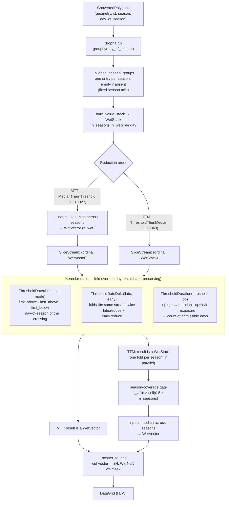
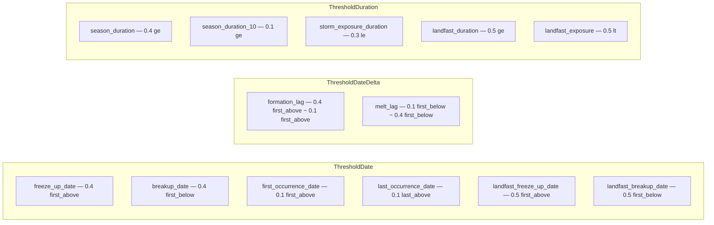

# climatology

Ice climatology pipeline: CIS charts (PostGIS `sgrda`) → per-metric climatological grids.

> **Scope note.** This README currently documents only `processing/`. The end-to-end pipeline
> (`pipeline.py`, `main.py`, `services/`, `viz/`) belongs here too and is not yet written.

## Processing

`processing/` turns a season-stacked set of per-date ice polygons into one `(H, W)` grid per
metric. Two things vary independently, and the design keeps them orthogonal:

- **The kernel** — *what* is measured along the day axis (a crossing date, a lag between two
  crossings, a day count).
- **The reduction order** — *when* the cross-season median is taken, before the kernel fold
  (MTT, DEC-027) or after it (TTM, DEC-049).

Kernels fold a `SliceStream` and preserve whatever shape they are fed, so the same three kernels
serve both orders: MTT streams a `(n_wet,)` median vector per day, TTM streams the full
`(n_seasons, n_wet)` day stack and folds every season in parallel.

### Reduction flow

Two details that are easy to miss when reading `reductions.py`:

- `SliceStream` is a zero-arg factory rather than a bare iterator because `ThresholdDateDelta`
  folds the same stream twice.
- TTM medians with interpolating `np.nanmedian`, MTT with `_nanmedian_high`. This asymmetry is
  provisional, pending MPO ground-truth validation (DEC-049).

### Metric → kernel bindings

The metric table in `metrics.py` is data, not code: a new metric is a new row binding a threshold
and a mode/operator to one of the three kernels.

Thresholds are CT fractions; `landfast_*` metrics additionally carry a tier restriction (see
`metrics.py`). Reduction orders are selected on the CLI via `--temporal {mtt,ttm}`.