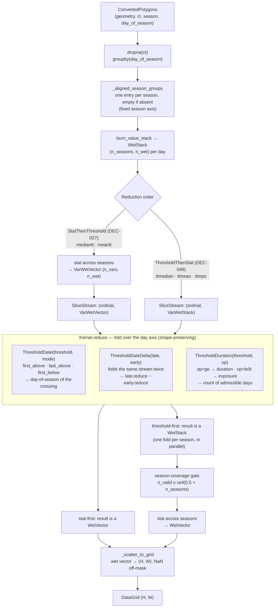
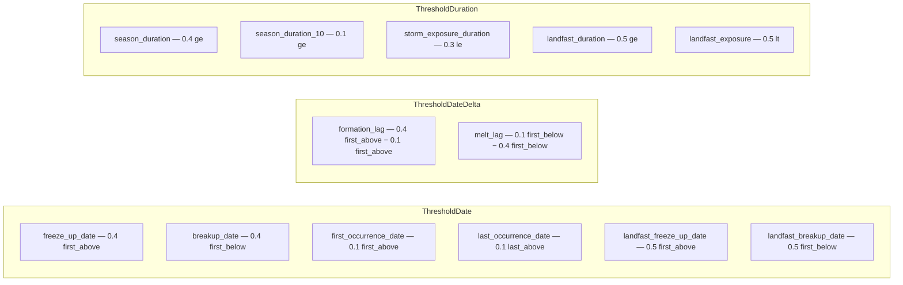

# climatology

Ice climatology pipeline: CIS charts (PostGIS `sgrda`) → per-metric climatological grids.

> **Scope note.** This README currently documents only `processing/`. The end-to-end pipeline
> (`pipeline.py`, `main.py`, `services/`, `viz/`) belongs here too and is not yet written.

## Processing

`processing/` turns a season-stacked set of per-date ice polygons into one `(H, W)` grid per
metric. Two things vary independently, and the design keeps them orthogonal:

- **The kernel** — *what* is measured along the day axis (a crossing date, a lag between two
  crossings, a day count).
- **The reduction** — *when* the season axis is collapsed, before the kernel fold
  (`{median,mean}tt`, DEC-027) or after it (`tt{median,mean,mpo}`, DEC-049), and *with which
  statistic* (DEC-054).

Kernels fold a `SliceStream` and preserve whatever shape they are fed, so the same three kernels
serve both orders: a stat-first order streams a `(n_wet,)` collapsed vector per day, a
threshold-first order streams the full `(n_seasons, n_wet)` day stack and folds every season in
parallel.

### Reduction flow

```mermaid
flowchart TD
    DF["ConvertedPolygons<br/>(geometry, ct, season, day_of_season)"] --> DROP["dropna(ct)<br/>groupby(day_of_season)"]
    DROP --> ALIGN["_aligned_season_groups<br/>one entry per season, empty if absent<br/>(fixed season axis)"]
    ALIGN --> BURN["burn_value_stack → WetStack<br/>(n_seasons, n_wet) per day"]

    BURN --> ORDER{"Reduction order"}

    ORDER -->|"StatThenThreshold (DEC-027)<br/>mediantt · meantt"| MED1["stat across seasons<br/>→ VarWetVector (n_vars, n_wet)"]
    MED1 --> STREAM_M["SliceStream: (ordinal, VarWetVector)"]

    ORDER -->|"ThresholdThenStat (DEC-049)<br/>ttmedian · ttmean · ttmpo"| STREAM_T["SliceStream: (ordinal, VarWetStack)"]

    STREAM_M --> K
    STREAM_T --> K

    subgraph K["Kernel.reduce — fold over the day axis (shape-preserving)"]
        direction TB
        KA["ThresholdDate(threshold, mode)<br/>first_above · last_above · first_below<br/>→ day-of-season of the crossing"]
        KB["ThresholdDateDelta(late, early)<br/>folds the same stream twice<br/>→ late.reduce − early.reduce"]
        KC["ThresholdDuration(threshold, op)<br/>op=ge → duration · op=le/lt → exposure<br/>→ count of admissible days"]
    end

    K --> OUT_M["stat-first: result is a WetVector"]
    K --> OUT_T["threshold-first: result is a WetStack<br/>(one fold per season, in parallel)"]

    OUT_T --> COV["season-coverage gate<br/>n_valid ≥ ceil(0.5 × n_seasons)"]
    COV --> MED2["stat across seasons<br/>→ WetVector"]

    OUT_M --> SCAT["_scatter_to_grid<br/>wet vector → (H, W), NaN off-mask"]
    MED2 --> SCAT
    SCAT --> GRID["DataGrid (H, W)"]
```

Two details that are easy to miss when reading `reductions.py`:

- `SliceStream` is a zero-arg factory rather than a bare iterator because `ThresholdDateDelta`
  folds the same stream twice.
- Both orders median with `_nanmedian_high`, never the interpolating `np.nanmedian`: the
  DEC-035 argument applies to the per-season *dates* as much as to the CT series, since an
  interpolated median lands between two weekly charts, on a day no chart was published for.
- `ttmpo` differs from `ttmean` only in its denominator — the record length rather than the
  seasons that crossed — so a season without a crossing dilutes the cell instead of dropping
  out (DEC-053). The 50 % coverage gate is identical across all three threshold-first
  variants, so a comparison between them isolates the statistic alone.

### Metric → kernel bindings

The metric table in `metrics.py` is data, not code: a new metric is a new row binding a threshold
and a mode/operator to one of the three kernels.

```mermaid
flowchart LR
    subgraph TD_K["ThresholdDate"]
        M1["freeze_up_date — 0.4 first_above"]
        M2["breakup_date — 0.4 first_below"]
        M3["first_occurrence_date — 0.1 first_above"]
        M4["last_occurrence_date — 0.1 last_above"]
        M5["landfast_freeze_up_date — 0.5 first_above"]
        M6["landfast_breakup_date — 0.5 first_below"]
    end
    subgraph TDD_K["ThresholdDateDelta"]
        M7["formation_lag — 0.4 first_above − 0.1 first_above"]
        M8["melt_lag — 0.1 first_below − 0.4 first_below"]
    end
    subgraph TDUR_K["ThresholdDuration"]
        M9["season_duration — 0.4 ge"]
        M10["season_duration_10 — 0.1 ge"]
        M11["storm_exposure_duration — 0.3 le"]
        M12["landfast_duration — 0.5 ge"]
        M13["landfast_exposure — 0.5 lt"]
    end
```

Thresholds are CT fractions; `landfast_*` metrics additionally carry a tier restriction (see
`metrics.py`). Reductions are selected on the CLI via `--reduction {mediantt,meantt,ttmedian,ttmean,ttmpo}`.